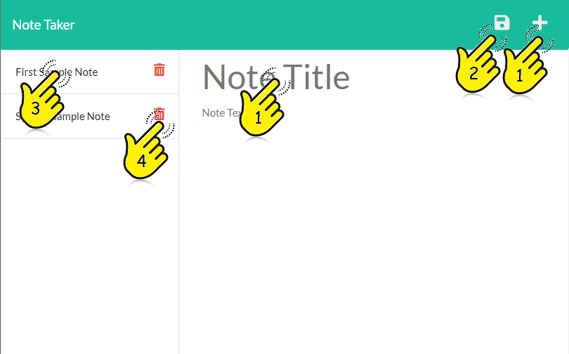

# Crud Note Taker
Homework 11 for Georgia Tech Coding Boot Camp  
Matthew Tanner
Heroku Deployment: https://crud-note-taker.herokuapp.com/

## Description
This application allows the user to enter and save notes for later viewing and deleting.

## Movitavtion
This is a student project intended to demonstrate the ability to affect information persistence employing the nodes.js Express module to implement a simple JSON database.

## Table of Contents
[Installation](#installation) 

 [Usage](#usage) 

 [License](#license) 
 
## Installation
This application is deployed via Heroku (https://www.heroku.com/) and is publicly available at https://crud-note-taker.herokuapp.com/.

## Usage
1. From any state, to enter a note, simple click the plus sign 'Add Button', click the respective 'Title' or 'Text' areas and enter your note. Note that complete notes must have both a note title and text.  
2. To save a note, click on the diskete 'Save' icon. Note the the diskete icon only appears once a complete note has been entered.
3. To select a saved note for reading, click on it's title in the right column.    
4. To delete a saved note, click on it's respective waste paper basket.   

## License
MIT License

Copyright (c) 2022 Matthew J. Tanner

Permission is hereby granted, free of charge, to any person obtaining a copy
of this software and associated documentation files (the "Software"), to deal
in the Software without restriction, including without limitation the rights
to use, copy, modify, merge, publish, distribute, sublicense, and/or sell
copies of the Software, and to permit persons to whom the Software is
furnished to do so, subject to the following conditions:

The above copyright notice and this permission notice shall be included in all
copies or substantial portions of the Software.

THE SOFTWARE IS PROVIDED "AS IS", WITHOUT WARRANTY OF ANY KIND, EXPRESS OR
IMPLIED, INCLUDING BUT NOT LIMITED TO THE WARRANTIES OF MERCHANTABILITY,
FITNESS FOR A PARTICULAR PURPOSE AND NONINFRINGEMENT. IN NO EVENT SHALL THE
AUTHORS OR COPYRIGHT HOLDERS BE LIABLE FOR ANY CLAIM, DAMAGES OR OTHER
LIABILITY, WHETHER IN AN ACTION OF CONTRACT, TORT OR OTHERWISE, ARISING FROM,
OUT OF OR IN CONNECTION WITH THE SOFTWARE OR THE USE OR OTHER DEALINGS IN THE
SOFTWARE.
